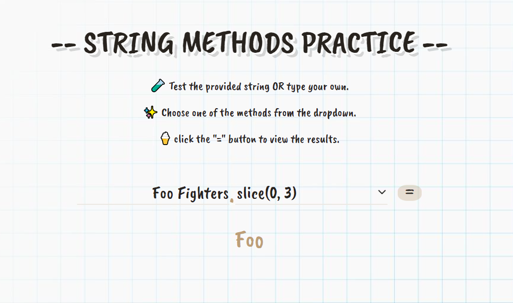

# JS String - from Theory to Practice

React Typescript App - Practice String Methods using a form.

👉 [Watch DEMO](https://Frnt-End.github.io/The-String-Theory-React-Typescript)

## String Methods Practice UI

- 🧪 Test the provided string OR type your own.
- ✨ Choose one of the methods from the dropdown.
- 🍦 click the "=" button to view the results.

## Local View

In your fav IDE: navigate to the main folder and type in the terminal:

##### `npm start` or `yarn start`

👉 [Online DEMO](https://Frnt-End.github.io/The-String-Theory-React-Typescript)

---

Enjoy using the app..😉

---

### License

Copyright © 2019 @frnt-end
[Nirit Nagar](https://github.com/Frnt-End)

